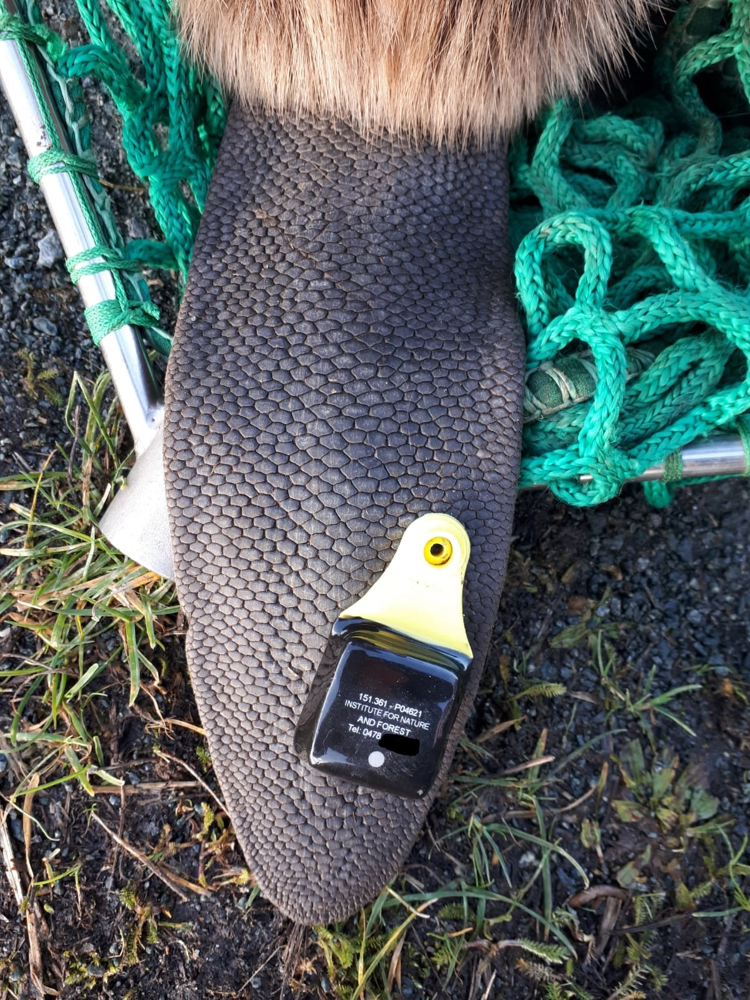

#Materiaal en Methoden

##Inventarisatie

We hebben
`r length(unique(levels(Zenderbevers$Bever)))`
gezenderd.

##Telemetrie

tekst

- opsomming 1,
- opsomming 2.


```{r Fotozender, fig.cap = "Voorbeeld zender.", echo=FALSE}

```

\FloatBarrier

##Dataverwerking

De verwerking van de gegevens gebeurde in het programma _R_ versie 3.5.1.
