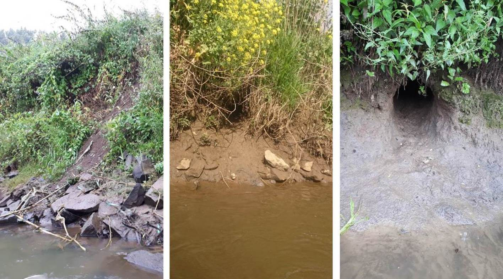
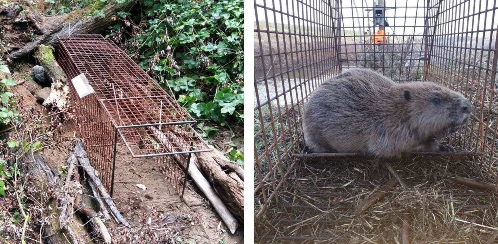

#Materiaal en Methoden

##Inventarisatie {#h:inventaristatiemm}

In 2017 werden op 19 april en 30 augustus twee grondige inspecties van de Dijleoevers uitgevoerd vanop het water. Hier werd bij een gecontroleerd verlaagde waterstand met een kano vanaf de samenvloeiing van Demer en Dijle in Werchter tot aan de brug ter hoogte van de Brugstraat in Muizen gevaren. Door de lage waterstand werden holen die zich onder de waterlijn bevonden vanop het water goed zichtbaar.

Tijdens de inventarisaties werden de verschillende beversporen opgedeeld in drie types sporen (Fig.\@ref(fig:Spoortypes)):

- Wissels

- Dagrustplaatsen

- Holen

Vooral holen vormen een structurele bedreiging voor de stabiliteit van de dijken. Ook sommige dagrustplaatsen kunnen in de dijk zijn ingegraven maar bevinden zich steeds boven de hoogwaterlijn en strekken zich veel minder diep (<1 m) in de dijk uit. Op locaties waar verschillende beversporen zich op dezelfde plaats bevonden werden alle spoortypes beschreven maar werd de locatie getypeerd in volgorde van belang (hol > dagrustplaats > wissel) (zie ook verder Fig. \@ref(fig:kaartapril) en Fig. \@ref(fig:kaartaugustus)).

Deze aanpak zorgde ervoor dat een eerste indruk werd verkregen van een eventuele clustering van sporen binnen het studiegebied om zo een inschatting van het aantal mogelijke territoria te krijgen. Daarnaast liet deze aanpak toe na te gaan op welke plaatsen het risico op structurele schade het hoogst was en of er seizoenale verschuivingen (voorjaar/zomer) optraden.

```{r Spoortypes, fig.cap = "De verschillende types sporen die in kaart werden gebracht tijdens de inventarisaties. Van links naar rechts: wissel, dagrustplaats en hol.", echo=FALSE}

```

##Telemetrie {#h:telemetriemm}

###Vangen {#h:vangenmm}

Voor het levend vangen van bevers werd binnen een initiële verkenningsronde tussen juli en oktober 2017 geëxperimenteerd met kooien en klapvallen (type _Bailey_). Gedurende deze periode werden vier bevers gevangen. Drie bevers werden in een kooi gevangen, de vierde (BE1004) werd met een schepnet gevangen op een betonnen vijver waarin het dier vast was komen te zitten. Op basis van deze ervaringen werd geopteerd om enkel een inloopkooi op het land met valdeuren aan beide zijden te gebruiken, een zogenaamde tunnelval-principe dat zijn effectiviteit heeft bewezen [@Rosell1998a]. De hier gebruikte vallen hebben een afmeting van `L 2,15 * B 0,60 * H 0,70` m en zijn vervaardigd uit bouwstaalmatten van 8 mm met een maaswijdte van 5 cm (zie Fig. \@ref(fig:Bevervangst) links). Binnen dit project werden vanaf 2018 in totaal zeven van dergelijke vallen ingezet. De vallen werden uitgerust met wildcamera’s van het type _Dörr Snapshot Mobil SSL GPRS 5.1 Black_ (zie Fig. \@ref(fig:Bevervangst) rechts). Dergelijke camera's sturen bij detectie van warmte en beweging een  foto via e-mail door, zodat een directe controle vanop afstand mogelijk is en in geval van vangst snel mensen ter plaatse kunnen zijn. 

Na de proefperiode in 2017 werden binnen de projecttermijn in totaal nog vier bijkomende vangstperiodes georganiseerd (5 feb – 16 maa 2018, 28 mei – 11 jun 2018, 17 sep - 6 okt 2018 en 28 jan – 22 feb 2019). Binnen deze periodes werd een maximaal aantal vallen langere tijd op plaatsen met gekende activiteit opgesteld. In functie van activiteit op camera’s, sporen en het aantal gekende dieren dat kon worden gevangen, werd het aantal vallen en locaties gaandeweg aangepast doorheen deze periodes zodat de vangstgegevens binnen dit project niet toelaten een analyse van de efficiëntie op de verschillende tijdstippen uit te voeren. Wel tonen de vangstgegevens van de gezenderde bevers aan dat zowel voorjaar (februari-mei) als het najaar (september-oktober) zeer geschikt zijn om te vangen, zoals ook beschreven in de literatuur [@Rosell1998a; @Windels2016].

```{r Bevervangst, fig.cap = "Beeld van een inloopkooi gemaakt door een wildcamera (links). Gevangen bever in kooi met wildcamera in de achtergrond (rechts).", echo=FALSE}

```

###Zenderen {#h:zenderenmm}
 
Gevangen bevers werden vanuit de kooi in een schepnet gedreven, waarin ze op de grond werden gefixeerd en waarbij hun ogen met een stuk stof werden afgedekt. Bevers die op deze manier gefixeerd worden, houden zich rustig zodat alle nodige handelingen in minder dan 30 minuten werden uitgevoerd. Vervolgens werden lichaamslengte (snuit-staart), staartlengte en staartbreedte genoteerd. Het geslacht werd niet standaard bepaald, omdat dit enkel door palpatie van het baculum of het aftappen van anaalkliersecreet mogelijk is, wat op het terrein moeilijk is. Er werd daarom geopteerd om naderhand op basis van waarnemingen en gedrag een inschatting van het geslacht te maken.

Na het verzamelen van deze biometrische gegevens werd ter identificatie bij elke bever een onderhuidse transponder (PIT, type _Trovan ID-100_) ter hoogte van de linkerschouder geïmplanteerd. Vergelijkbare transponders worden gebruikt bij honden en katten en laten toe teruggevonden of teruggevangen bevers te herkennen met behulp van een uitleesapparaat (type _Trovan LID 560_), ook wanneer andere merktekens verdwenen zouden zijn. In de staart werd verder, op enkele centimeter van de rand, een gemodificeerd oormerk met VHF-zender en mortaliteitssensor aangebracht [@Arjo2008; @Windels2016]. Aanvankelijk werden zowel zenders met uitwendige antenne als met inwendige antenne  gebruikt (Fig. \@ref(fig:Fotozender)). Zenders met een uitwendige antenne zouden een beter signaal kunnen genereren, wat bij een voornamelijk in het water levend zoogdier als de bever niet onbelangrijk is. Evenwel bleek snel dat zenders met uitwendige antenne sneller uit de staart scheurden. Om die reden werd  tijdens het project overgeschakeld naar enkel zenders met inwendige antennes. Vier van de uiteindelijk gebruikte zenders met uitwendige antenne waren van het type _Advanced Telemetry Systems Tail Tag Transmitter_ (38 g) en twee van het type _Sirtrack Ear Tag V2E 154B Whip_ (30 g). Er werden daarnaast 19 zenders met inwendige antenne aangebracht van het type _Sirtrack Ear Tag V2E 154A Loop_ (27 g). Dit geeft een totaal van 25 zenders op `r length(unique(levels(Zenderbevers$Bever)))` opgevolgde bevers, een gevolg van het opnieuw zenderen van bevers bij wie de zender was verdwenen of waarvan de batterijlevensduur was verstreken. Bij het manipuleren van gevangen bevers werd finaal, in functie van eventuele heridentificatie op camervalfoto’s, een beeld van de staart gemaakt, nadat de zender werd geplaatst (zie ook Fig. \@ref(fig:Fotozender)) en werden bevers gewogen tot op 100 g nauwkeurig. Alle zenders werden geprogrammeerd op een frequentie van 30 pulsen/min. en een mortaliteitsinterval van 6 uren, wat overeenkomt met een verwachte levensduur van de batterij van 420 dagen.

Eenmalig werd een GPS datalogger op een bever aangebracht. Ondanks het volgen van het protocol [@Graf2016] ging deze zender echter al na 1 dag verloren en werden er geen verdere pogingen ondernomen om GPS loggers te gebruiken.

```{r Fotozender, fig.cap = "VHF-zender met uitwendige (links) en inwendige (rechts) antenne, aangebracht als staarttag bij bevers gevangen op de beneden-Dijle.", echo=FALSE}
include_graphics("afbeeldingen/Staartzenders.jpg")
```

###Telemetrie {#h:telemetrie2mm}

Bevers die van een zender waren voorzien konden worden opgevolgd via telemetrie. Dit laat toe de omgeving af te scannen op de specifieke frequenties die door elk van de actieve beverzenders worden uitgezonden. Hiervoor gebruikten we een ontvanger, type _Biotrack Sika receiver_ en twee verschillende types van antennes. Dit laat toe de omgeving af te scannen op de specifieke frequenties die door elk van de actieve beverzenders worden uitgezonden. In eerste instantie werd met behulp van een vaste, met een magneet op het dak van een wagen bevestigde antenne, type _Magmount omni-directional_, de wijde omgeving al rijdend gescand. Het oppikken van een signaal (korte piep) op een bepaalde frequentie betekent dat de bever met de zender met die bepaalde frequentie in de buurt is, meestal binnen enkele honderden meters. Een monotoon signaal van 30 pulsen/min. wees op een bever in rust, een licht verhoogd ritme (afhankelijk van het type zender) gaf aan dat de bever actief was en een sterk verhoogd ritme wees op langdurige inactiviteit (> 6 u, mortaliteitssignaal). Na het oppikken van een signaal met de dakantenne werd lokaal overgeschakeld op het gebruik van een handantenne, type _Lintec flexible Yagi_. Door met deze antenne telkens de richting te bepalen waarin het signaal het sterkst is, kon de exacte locatie van het signaal worden bepaald. Door het feit dat bevers zich voornamelijk op waterlopen ophouden kon dit hoofdzakelijk worden gedaan door langs de jaagpaden op de dijken te rijden en daar vervolgens op verder te stappen. Dit resulteerde ofwel in een directe waarneming van de bever of in een signaal van een bever die zich op een vaste locatie onder de grond in een hol of burcht bevond zodat het telkens mogelijk was aan de hand van GPS en orthofoto’s binnen de Google MyMaps applicatie op smartphone de exacte locatie van de bever op dat tijdstip te bepalen en online op te slaan. Bij het oppikken van een mortaliteitssignaal werd telkens geprobeerd om de zender en/of bever terug te vinden. Lukte dit niet dan werd tijdens volgende controles nagegaan of het mortaliteitssignaal nog steeds op dezelfde locatie te horen was. Na bevestiging werd deze zender als inactief geregistreerd en werden bij verdere data-analyse de gegevens van deze zender beperkt tot en met het laatste actieve signaal.

```{r, bezoeken, include=FALSE}
##maximale afstanden berekenen per beest
Visits <- as.data.frame(Telemetrie[,1])
colnames(Visits) <- c("Datum")
Visits <- Visits %>% distinct() %>% drop_na()
Visits$Tijdstip <- as.numeric(Visits$Datum)
Visits$rank <- rank(Visits$Tijdstip)
Visits$Visit <- 1

for (i in 2 : max(Visits$rank)){
  if (Visits$Tijdstip[Visits$rank == i] - Visits$Tijdstip[Visits$rank == i-1] < 21600){
    Visits$Visit[Visits$rank == i] <- Visits$Visit[Visits$rank == i-1] 
  } else {
    Visits$Visit[Visits$rank == i] <- Visits$Visit[Visits$rank == i-1] + 1
  }
}

Visits <- Visits %>% 
  mutate(Maand = month(Datum)) %>%
  mutate(Jaar = year(Datum)) %>% 
  group_by(Jaar, Maand) %>% 
  mutate(Aantal = length(unique(Visit))) %>% 
  droplevels()

Time <- Visits %>% 
  group_by(Visit) %>% 
  summarise(Uren = (max(Tijdstip) - min(Tijdstip))/3600)
```

Dit terreinwerk werd uitgevoerd op `r max(Visits$Visit)` verschillende momenten doorheen de studieperiode, verdeeld over de verschillende maanden zoals getoond in figuur \@ref(fig:ggBezoekenMaand). Daaruit blijkt dat maandelijks minstens vijf veldbezoeken gebeurden, behalve in de tweede helft van 2019, toen er nog maar een beperkt aantal bevers met actieve zenders in het gebied aanwezig waren. Met uitzondering van de maand juni werd elke maand in minstens twee verschillende jaren bemonsterd. Verder werden in elke maand over alle jaren minstens 10 veldbezoeken uitgevoerd, hier met uitzondering van de maand juli, waar in totaal zeven veldbezoeken plaatsvonden over twee verschillende jaren. In het totaal werden `r round(sum(Time$Uren),0)` uren gepresteerd aan telemetrie veldwerk, berekend als de tijd tussen de registratie van de eerste lokalisatie en de laatste tijdens eenzelfde bezoek. De duur van een enkel bezoek bedroeg gemiddeld `r round(mean(Time$Uren),1)` uur, met een maximum van `r round(max(Time$Uren), 1)` uur.

```{r ggBezoekenMaand, fig.cap= "Verdeling van het aantal bezoeken in een gegeven maand over de verschillende jaren van de studie.", warning=FALSE}
plot <- Visits %>% 
group_by(Maand, Jaar) %>% 
summarise(Aantal = max(Aantal))

ggplot(plot, aes(x=Maand, y=Aantal)) +
  geom_bar(stat = "identity") +
  facet_wrap(~Jaar) +
  scale_x_continuous(breaks = seq(1,12, by=1)) +
  scale_y_continuous(breaks = seq(1,19, by=2)) +
  ylab("Aantal bezoeken")
```

\FloatBarrier

##Dataverwerking {#h:dataverwerkingmm}

De verwerking van de gegevens gebeurde in het programma _R_ versie 3.5.1. [@R2019].


###Home range {#h:homerangemm}

Als basis om het gedrag van de lokaal aanwezige bevers te analyseren wordt per bever de zogenaamde _home range_ berekend. Deze term wordt vaak als synoniem voor territorium gebruikt, maar verschilt daar toch wezenlijk van [@Burt1943]. Een home range is het gehele gebied waarin een bepaald individu (of een groep) het grootste deel van zijn tijd doorbrengt en dat wordt gebruikt om alle normale levensactiviteiten te vervullen. Het is dus belangrijk dat binnen een dergelijk gebied voldoende middelen zoals burchten en holen, foerageer- en schuilplaatsen aanwezig zijn om het voortbestaan te garanderen. Een home range kan deels of geheel overlappen met soortgenoten en doorheen het jaar wijzigen in functie van specifieke noden. Een _territorium_ is daarentegen een gebied dat door een individu (of groep) verdedigd wordt om er zeker van te zijn dat alleen zij gebruik kunnen maken van de aanwezige middelen [@Fryxell2014; @Campbell2005]. 

Bevers leven in familieverband binnen een territorium in het landschap dat jaarrond tegen soortgenoten wordt verdedigd en waarvan de grenzen met geursporen worden gemarkeerd [@Campbell2005; @Muller2003]. Alle leeftijdsklassen en beide geslachten binnen een beverfamilie nemen deel aan de markering van de territoriumgrenzen en er is weinig verschil tussen de home range en het territorium [@Muller2003]. De foerageerplaatsen op het land die zich in de nabijheid van water bevinden, behoren daarbij tot de home range terwijl de dammen, holen, burchten en belangrijkste wissels onderdeel van het territorium zijn [@Muller2003]. 
De grootte van de home range kan doorheen het jaar verschillen afhankelijk van de kwaliteit van de leefomgeving, lokale populatiedichtheden maar ook in functie van het geslacht: hoewel er in de regel geen verschil is in de grootte van home ranges van mannelijke en vrouwelijke bevers [@Herr2004; @Korbelova2016], spenderen mannetjes in het voorjaar meer tijd aan de grenzen van het territorium dan vrouwtjes, die op dat tijdstip van het jaar de jongen zogen [@Muller2003; @Rosell2006]. Doorheen de tekst wordt in dit rapport telkens enkel over territorium gesproken in kader van het actief verdedigde leefgebied van een familiegroep.

Om de individuele home ranges te bepalen wordt gebruik gemaakt van de verzamelde locaties waarbinnen een bever werd waargenomen en via _Minimum Convex Polygon_ (MCP) berekend. Hierbij wordt een polygoon geconstrueerd die alle geregistreerde locaties van 1 dier bevat en waarbinnen geen enkele interne hoek groter is dan 180° [@Burgman2003]. Om een al te groot effect van uitschieters te vermijden wordt daarbij een percentage van de locaties die het verst van het centroïd van alle locaties samen zijn gelegen verwijderd. Het bepalen van het percentage dat binnen deze studie best geschikt was maakt deel uit van de analyses (zie \@ref(h:MCPanalyses)) Voor de berekening van de MCP werd gebruik gemaakt van het _adehabitatHR package_ in R [@Calenge2006].

MCP is een internationale, makkelijk toe te passen, standaardmethode om home ranges te schatten, zeker in omstandigheden waarbij enkel met aanwezigheidsgegevens wordt gewerkt, zoals hier het geval is [@Burgman2003]. Toch kan de methode een vertekend beeld geven, bijvoorbeeld bij een specifieke onderliggende vorm van het eigenlijke habitat [@Burgman2003]. Alhoewel er methoden bestaan om dit aan te passen, zijn deze veel ingewikkelder en maar nuttig bij het inschatten van verschillen en verschuivingen over langere termijn wat niet de doelstelling van dit onderzoek was. Voor dit onderzoek was het gebruik van MCP dus geoorloofd.

Omdat veel onderzoeken naar bever met dezelfde problemen bij het schatten van de exacte grootte van home ranges worden geconfronteerd wordt in veel studies de rivier- of oeverlengte als maat voor de home range grootte gehanteerd [@Fustec2001; @Campbell2005]. Deze methode onderschat de effectieve grootte van de home range maar werd eveneens in deze studie mee berekend om een vergelijking met andere studies over bever in Europa mogelijk te maken.

