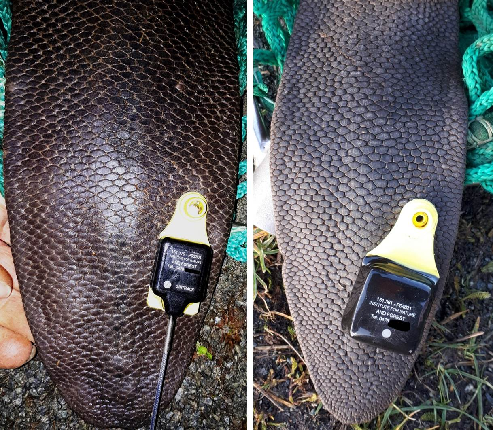

#Materiaal en Methoden

##Inventarisatie

We hebben
`r length(unique(levels(Zenderbevers$Bever)))`
gezenderd.

##Telemetrie

###Vangen

Voor het levend vangen van bevers werd binnen een initiële verkenningsronde tussen juli en oktober 2017 geëxperimeteerd met kooivallen en klapvallen (type _Bailey_). Gedurende deze periode werden vier bevers gevangen. Drie bevers werden in een kooival gevangen, de vierde (BE1004) werd met een schepnet gevangen op een betonnen vijver waarin het dier vast was komen zitten. Op basis van deze ervaringen werd geopteerd om enkel een inloopkooi op het land met valdeuren aan beide zijden te gebruiken, een zogenaamde tunnelval-principe dat zijn effectiviteit voldoende heeft bewezen [@Rosell1998]. De hier gebruikte vallen hebben een afmeting van `L 2,15 * B 0,60 * H 0,70`m en zijn vervaardigd uit bouwstaalmatten van 8 mm met een maaswijdte van 5 cm (zie fig. \@ref(fig:Bevervangst) links). Binnen dit project werden vanaf 2018 in totaal zeven van dergelijke vallen ingezet. De vallen werden uitgerust met wildcamera’s van het type _Dörr Snapshot Mobil SSL GPRS 5.1 Black_ (zie fig. \@ref(fig:Bevervangst) rechts). Dergelijke camera's sturen bij detectie van warmte en beweging een beeld door naar een e-mail postvak zodat een directe controle mogelijk is en in geval van vangst snel mensen ter plaatse kunnen zijn . 

Na de proefperiode in 2017 werden binnen de projecttermijn in totaal nog vier bijkomende vangstperiodes georganiseerd (5 feb – 16 maa 2018, 28 mei – 11 jun 2018, 17 sep - 6 okt 2018 en 28 jan – 22 feb 2019). Binnen deze periodes werd een maximaal aantal vallen langere tijd op plaatsen met gekende activiteit opgesteld. In functie van activiteit op camera’s, sporen en het aantal gekende dieren dat kon worden gevangen, werd het aantal vallen en locaties gaandeweg aangepast doorheen deze periodes zodat de vangstgegevens binnen dit project niet toelaten een analyse van de efficiëntie op de verschillende tijdstippen uit te voeren. Wel tonen de vangstgegevens van de gezenderde bevers aan dat zowel voorjaar (februari-mei) als het najaar (september-oktober) zeer geschikt zijn om te vangen, zoals ook beschreven door [@Rosell1998] en [@Windels2016].

```{r Bevervangst, fig.cap = "Beeld van inloopkooi gemaakt door wildcamera (links). Gevangen bever in kooi met wildcamera (rechts).", echo=FALSE}
include_graphics("afbeeldingen/Bevervangst.jpg")
```

###Zenderen

Gevangen bevers werden vanuit de kooi gevangen in een schepnet, waarin ze op de grond werd gefixeerd en waarbij de kop werd afgedekt. Op deze manier gefixeerde bevers houden zich verder rustig zodat alle nodige handelingen in minder dan 30 minuten kunnen worden afgewerkt. Tijdens deze fixatie werden eerst lichaamslengte (snuit-staart), staartlengte en staartbreedte genoteerd. Het geslacht werd op dit moment niet bepaald, dit kan immers enkel door palpatie van het baculum, wat moeilijk is, zodat vaak ook genetische analyse of post-mortem onderzoek voor geslachtsbepaling wordt gebruikt [@Windels2016]. Er werd daarom geopteerd om de dieren niet ter plaatse te seksen maar naderhand op basis van waarnemingen en gedrag een inschatting van het geslacht te maken.

Na het verzamelen van deze biometrische gegevens werd bij elke bever een onderhuidse passieve transponder (PIT, type _Trovan ID-100_) ingeplant ter hoogte van de linkerschouder. Dit moet toelaten later teruggevonden of –gevangen bevers te identificeren met een uitleesapparaat (hier type _Trovan LID 560_) ook wanneer andere merktekens zouden zijn verdwenen. In de staart werd verder, op enkele centimeter van de rand, een gemodificeerd oormerk met VHF-zender en mortaliteitssensor aangebracht [@Arjo2008; @Windels2016]. Aanvankelijk werden zowel zenders met uitwendige antenne als met inwendige antenne  gebruikt (fig. \@ref(fig:Fotozender)). Zenders met een uitwendige antenne zouden een beter signaal kunnen genereren, wat bij een voornamelijk in het water levend zoogdier als bever niet onbelangrijk is. Evenwel bleek snel dat zenders met uitwendige antenne sneller uit de staart scheurden, vermoedelijk door het ophopen van plantmateriaal rond de antenne. Om die reden werd  tijdens het project overgeschakeld naar enkel zenders met inwendige antennes. Vier van de uiteindelijk gebruikte zenders met uitwendige antenne waren van het type _Advanced Telemetry Systems Tail Tag Transmitter_ (38g) en twee van het type _Sirtrack Ear Tag V2E 154B Whip_ (30g). Er werden daarnaast 19 zenders met inwendige antenne aangebracht van het type _Sirtrack Ear Tag V2E 154A Loop_ (27g). Dit geeft een totaal van 25 zenders op `r length(unique(levels(Zenderbevers$Bever)))` opgevolgde bevers, een gevolg van het opnieuw zenderen van bevers bij wie de zender was verdwenen of waarvan de batterijlevensduur was verstreken. Bij het manipuleren van gevangen bevers werd finaal, in functie van eventuele heridentificatie op camervalfoto’s, een beeld van de staart gemaakt, nadat de zender werd geplaats (zie ook fig. \@ref(fig:Fotozender)) en werden bevers gewogen tot op 100g nauwkeurig. Alle zenders werden geprogrammeerd op een pulse frequentie van 30 pulses/min. en een mortaliteitsinterval van 6h, wat overeenkomt met een verwachte levensduur van de batterij van 420 dagen. 

```{r Fotozender, fig.cap = "VHF-zender met uitwendige (links) en inwendige (rechts) antenne, aangebracht op staarttag bij bevers gevangen op de beneden-Dijle.", echo=FALSE}

```

###Telemetrie

Bevers die van een zender waren voorzien konden worden opgevolgd via telemetrie. Hiervoor gebruikten we een ontvanger, type _Biotrack Sika receiver_ en twee verschillende antennes. Dit laat toe de omgeving af te scannen op de specifieke frequenties die door elk van de actieve beverzenders worden uitgezonden. In eerste instantie werd met behulp van een vaste, met een magneet op het dak van een wagen bevestigde antenne, type _Magmount omni-directional_, de wijde omgeving al rijdend gescand. Het oppikken van een ritmisch piepend geluid op een bepaalde frequentie betekent dan dat de bever met de zender die op die specifieke frequentie uitzendt in de buurt is, meestal binnen enkele honderden meters. Een enkel ritmisch signaal wees op een actieve bever, groepen van kort op elkaar volgende piepjes wijzen op langdurige inactiviteit (> 6h, mortaliteitssignaal). Na het oppikken van een signaal met de dakantenne werd lokaal overgeschakeld op een in de hand gehouden antenne, type _Lintec flexible Yagi_. Door met deze antenne telkens de richting te bepalen waarin het signaal het sterkst is kon de exacte locatie van het signaal worden bepaald. Door het feit dat bevers zich voornamelijk op waterlopen ophouden kon dit hoofdzakelijk worden gedaan door op de jaagpaden op de dijken te rijden en daar vervolgens op verder te stappen. Dit resulteerde ofwel in een directe waarneming van de bever of in een signaal van een bever die zich op een vaste locatie onder de grond in een hol of burcht bevond zodat het telkens mogelijk was aan de hand van gps en orthofoto’s binnen de Google Maps applicatie op smartphone de exacte locatie van de bever op dat tijdstip te bepalen. Bij het oppikken van een mortaliteitssignaal werd telkens geprobeerd de zender terug te bemachtigen of tijdens volgende controles bevestiging van het mortaliteitssignaal op dezelfde locatie te krijgen. Na bevestiging werden deze zender als inactief geregistreerd en werden bij verdere data-analyse de gegevens van deze zender beperkt tot en met het laatste actieve signaal.

```{r, bezoeken, include=FALSE}
##maximale afstanden berekenen per beest
Visits <- as.data.frame(Telemetrie[,1])
colnames(Visits) <- c("Datum")
Visits <- Visits %>% distinct() %>% drop_na()
Visits$Tijdstip <- as.numeric(Visits$Datum)
Visits$rank <- rank(Visits$Tijdstip)
Visits$Visit <- 1

for (i in 2 : max(Visits$rank)){
  if (Visits$Tijdstip[Visits$rank == i] - Visits$Tijdstip[Visits$rank == i-1] < 21600){
    Visits$Visit[Visits$rank == i] <- Visits$Visit[Visits$rank == i-1] 
  } else {
    Visits$Visit[Visits$rank == i] <- Visits$Visit[Visits$rank == i-1] + 1
  }
}

Visits <- Visits %>% 
  mutate(Maand = month(Datum)) %>%
  mutate(Jaar = year(Datum)) %>% 
  group_by(Jaar, Maand) %>% 
  mutate(Aantal = length(unique(Visit)))

Time <- Visits %>% 
  group_by(Visit) %>% 
  mutate(Uren = (max(Tijdstip) - min(Tijdstip))/3600)
```

Dit terreinwerk werd uitgevoerd op `r max(Visits$Visit)` verschillende momenten doorheen de studieperiode, verdeeld over de verschillende maanden zoals getoond in figuur \@ref(fig:ggBezoekenMaand). In het totaal werden `r sum(Time$Uren)` uren gepresteerd aan telemetriewerk, berekend als de tijd tussen de registratie van de eerste localisatie en de laatste tijdens eenzelfde bezoek. De duur van een enkel bezoek bedroeg gemiddeld `r round(mean(Time$Uren),digits=2)` uren, met een maximum van `r round(max(Time$Uren), digits=2)`.

```{r ggBezoekenMaand, fig.cap= "Verdeling van het aantal bezoeken in een gegeven maand over de verschillende jaren van de studie", warning=FALSE}
plot <- Visits %>% 
group_by(Maand, Jaar) %>% 
summarise(Aantal = max(Aantal))

ggplot(plot, aes(x=Maand, y=Aantal)) +
  geom_bar(stat = "identity") +
  facet_wrap(~Jaar) +
  scale_x_continuous(breaks = seq(1,12, by=1)) +
  scale_y_continuous(breaks = seq(1,19, by=2)) +
  ylab("Aantal bezoeken")
```

\FloatBarrier

##Dataverwerking

De verwerking van de gegevens gebeurde in het programma _R_ versie 3.5.1.
